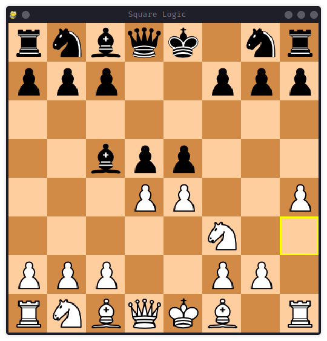
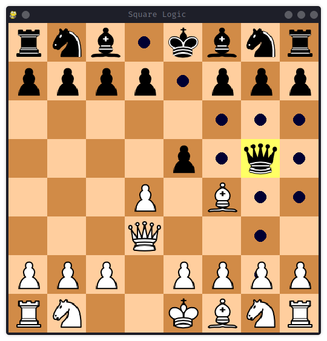

# Square Logic ♟️  

A simple yet interactive chess game built using **Python** and **Pygame**. This project features an intuitive chessboard, move validation, and user interactions for a smooth chess-playing experience.  

## 📌 Features  

- **Interactive Chessboard** – Click-based movement with move validation.  
- **Move Validation** – Checks for legal moves and prevents invalid ones.  
- **Undo Move** – Press `Backspace` to undo the last move.  
- **Hover & Selection Highlights** – Enhances visual clarity of moves.  
- **Pawn Promotion** – Automatically promotes pawns (default: Queen).  
- **Smooth Animations** – Runs at up to 144 FPS for fluid visuals.  

## 🛠️ Installation  

1. **Clone the repository**  
   ```bash
   git clone https://github.com/Princelad/SquareLogic.git
   cd SquareLogic
   ```  
2. **Install dependencies**  
   ```bash
   pip install -r requirements.txt
   ```  
3. **Run the game**  
   ```bash
   python Chess/ChessMain.py
   ```  

## 🎮 How to Play  

- Click on a piece to select it, then click on a valid square to move.  
- Press `Backspace` to undo the last move.  
- Hovering over squares will highlight them for better visibility.  

## 📁 Project Structure  

```
SquareLogic/
│── images/              # Chess piece images
│── Chess/               # Chess logic and engine
│   ├── ChessEngine.py   # Handles game rules and move validation
│   └── ChessMain.py     # Main driver script
│── README.md            # Project documentation
└── requirements.txt     # Dependencies
```

## 🖼️ Screenshots  

### Game State


### Selected Square and Move Highlighting

## 🚀 Future Improvements  

- Add **AI opponent** for single-player mode.   
- Enhance UI with **move history and timers**.  

## 📜 License  

This project is licensed under the **MIT License**.  

---
